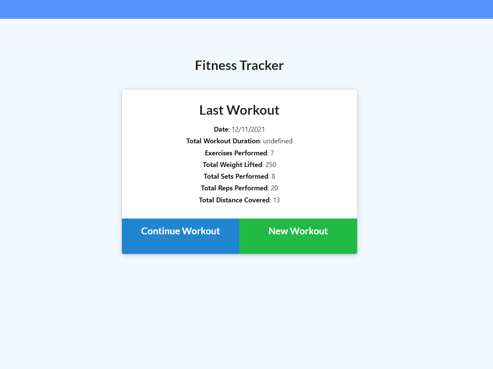

# Workout Tracker

## Licensing:

- [Description](#description)
- [Usage](#usage)
- [Additional Info](#additional-info)

## Site Link:

- [Click Here](https://damp-oasis-83805.herokuapp.com/)

## Description:

This website utilizes MongoDB (Mongoose) to track a user's workouts. You are able to start an exercise on the site and save it. The site will track your workout history and allow you to continue a workout later if needed.

## Usage:

To get started, simply click on the "New Workout" button on the homepage. On the following page, you will see a drop-down menu where you are able to select either cardio or resistance workouts. Once selected, you will be prompted to enter information about the workout and then you can save the exercise or comlpleete the workout if this is being continued.

Once a workout has been added, the homepage will display the date of the last workout, the duration of the workout and how many exercises were performed. At the top, left-hand corner of the page, you are able to click the "Dashboard" link which will display a graph of workout history.

## Additional Info:

- Github: [Mctastic](https://github.com/mctastic)
- Email: mctastic2121@gmail.com
